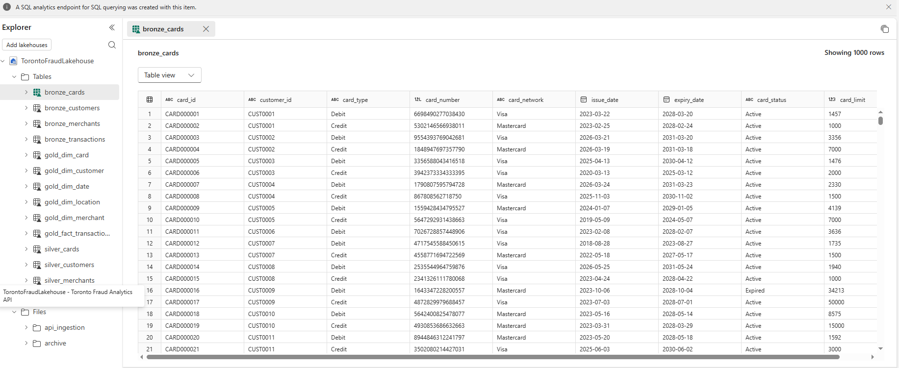
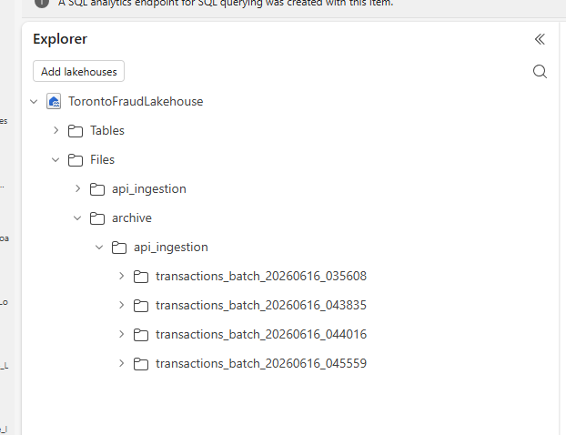
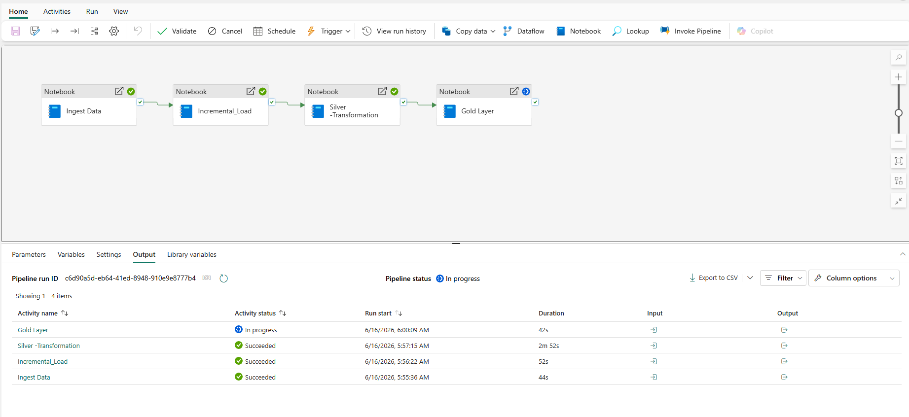
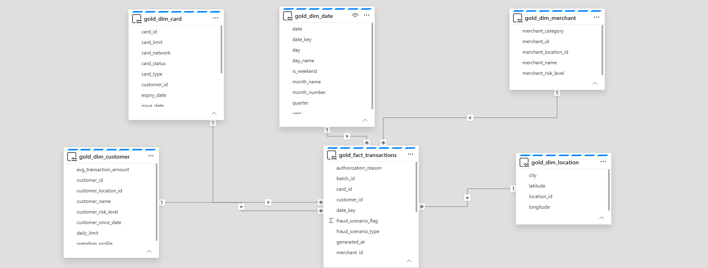
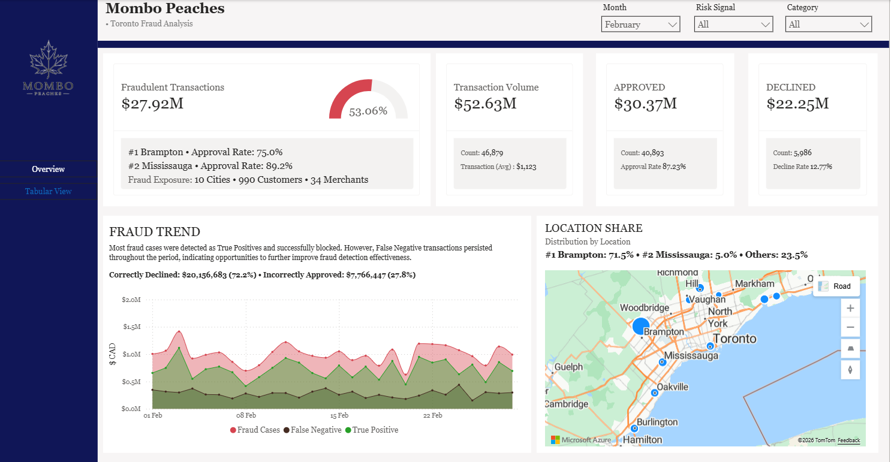
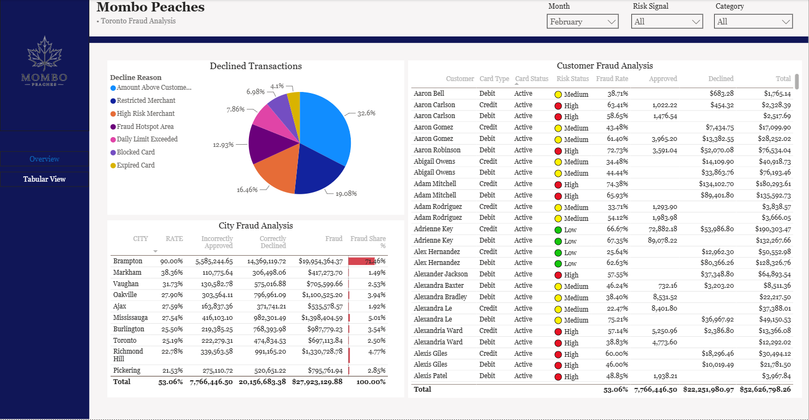
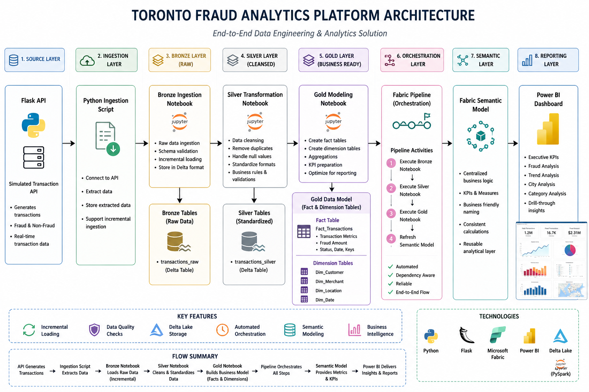

# Toronto Fraud Analytics Platform

## Overview

The Toronto Fraud Analytics Platform is an end to end data engineering and business intelligence solution designed to simulate the ingestion, processing, and analysis of financial transaction data for fraud monitoring.

The project demonstrates how transaction data can be generated through an API, ingested into Microsoft Fabric, transformed using a Medallion Architecture, orchestrated through Fabric Pipelines, modeled through a Semantic Model, and visualized in Power BI.

The solution follows modern data engineering practices including incremental loading, Lakehouse architecture, automated orchestration, and business-ready reporting.

---

## Business Problem

Financial organizations process thousands of transactions daily and require efficient mechanisms to identify fraudulent activity, reduce financial losses, and monitor transaction approval performance.

This project helps answer key business questions:

* How many fraudulent transactions occurred?
* Which cities experience the highest fraud activity?
* How many fraudulent transactions were correctly declined?
* How many fraudulent transactions were incorrectly approved?
* What trends exist across time and transaction categories?

---

## Project Architecture

```text
Flask API
    ↓
Python Ingestion Script
    ↓
Bronze Ingestion Notebook
    ↓
Bronze Lakehouse Tables
    ↓
Silver Transformation Notebook
    ↓
Silver Lakehouse Tables
    ↓
Gold Modeling Notebook
    ↓
Gold Fact & Dimension Tables
    ↓
Fabric Pipeline Orchestration
    ↓
Fabric Semantic Model
    ↓
Power BI Dashboard
```

---

## Technology Stack

### Programming

* Python
* SQL
* PySpark

### Data Engineering

* Microsoft Fabric
* Fabric Lakehouse
* Fabric Pipelines
* Delta Tables
* Medallion Architecture

### Analytics & Visualization

* Power BI
* DAX
* Fabric Semantic Model

### Development Tools

* Git
* GitHub

---


# Solution Components

## 1. Flask API

A custom Flask API was developed to simulate transaction activity.

The API generates realistic financial transaction records containing:

* Transaction ID
* Customer ID
* Merchant Information
* Transaction Amount
* Transaction Status
* Fraud Indicators
* Location Information
* Transaction Timestamp

This simulates a real-world source system that continuously produces transaction data.

---

## 2. Python Ingestion Script

The ingestion layer extracts transaction records from the API and prepares them for loading into Microsoft Fabric.

Key responsibilities:

* Connect to API endpoint
* Retrieve transaction data
* Store extracted data
* Support recurring ingestion cycles
* Feed downstream Fabric processes

---

## 3. Bronze Layer

### Bronze Ingestion Notebook

The Bronze notebook loads raw transaction data into the Lakehouse without applying business transformations.

Purpose:

* Preserve source data
* Create historical audit trail
* Store transactions in Delta format
* Support downstream transformations

Key Activities:

* Data ingestion
* Schema validation
* Raw data storage
* Incremental transaction loading

### Bronze Tables

Examples include:

* Transactions
* Customers
* Merchants
* Card Details

---

## 4. Silver Layer

### Silver Transformation Notebook

The Silver notebook performs cleansing and standardization of transaction records.

Key Activities:

* Remove duplicates
* Handle null values
* Standardize formats
* Validate transaction data
* Prepare fraud indicators
* Apply business rules

Benefits:

* Improved data quality
* Consistent reporting
* Reliable analytical outputs

---

## 5. Gold Layer

### Gold Modeling Notebook

The Gold notebook creates business ready analytical tables optimized for reporting and dashboarding.

Key Activities:

* Create fact tables
* Create dimension tables
* Business aggregations
* KPI preparation
* Reporting optimization

### Gold Data Model

#### Fact Table

FactTransactions

Contains:

* Transaction Metrics
* Fraud Amount
* Transaction Status
* Transaction Date
* Customer Keys
* Merchant Keys

#### Dimension Tables

DimCustomer

Contains customer information and demographic attributes.

DimMerchant

Contains merchant details and category information.

DimDate

Supports time intelligence and trend analysis.

DimLocation

Supports city and geographic reporting.

---


## Incremental Loading Strategy

The platform implements incremental loading to efficiently process only new transaction records.

Rather than reprocessing historical data during every execution, the solution loads only newly generated transactions.

Benefits:

* Faster execution times
* Reduced compute consumption
* Improved scalability
* Better production readiness
* Enterprise data engineering best practice

---



## Pipeline Orchestration

### Fabric Pipeline

A Fabric Pipeline orchestrates the complete workflow from ingestion through reporting.

Pipeline Activities:

1. Execute Bronze Notebook
2. Execute Silver Notebook
3. Execute Gold Notebook
4. Refresh Semantic Model

Benefits:

* Automation
* Dependency management
* Repeatable execution
* End to end orchestration
* Reduced manual intervention

---



## Semantic Model

A Fabric Semantic Model was created to provide a governed reporting layer between the Gold Lakehouse and Power BI.

The semantic model provides:

* Centralized business logic
* Consistent KPI calculations
* Business friendly field naming
* Reusable analytical layer
* Improved report performance

The Semantic Model serves as the primary reporting source for Power BI dashboards.

---



# Power BI Dashboard

The Power BI dashboard provides an executive level view of fraud activity and transaction performance.

## Key Performance Indicators

### Total Transactions

Total number of transactions processed.

### Fraud Transactions

Total number of identified fraudulent transactions.

### Fraud Amount

Total monetary value associated with fraud.

### Correctly Declined Fraud

Fraudulent transactions successfully blocked.

### Incorrectly Approved Fraud

Fraudulent transactions approved despite being fraudulent.

### Fraud Approval Rate

Percentage of fraud transactions that were approved.

### Average Fraud Transaction Amount

Average value of transactions.

---

## Dashboard Visuals

* Fraud Trend Over Time
* Fraud by City
* Fraud by Merchant Category
* Fraud Transaction Distribution
* Approved vs Declined Fraud Analysis
* Fraud Amount Analysis
* Detailed Transaction Table

---

# Repository Structure

```text
Toronto-Fraud-Analytics-Platform/
│
├── app.py
├── ingest_transactions.py
│
├── notebooks/
│   ├── bronze_ingestion.ipynb
│   ├── silver_transformation.ipynb
│   └── gold_model.ipynb
│
├── pipeline/
│   └── fabric_pipeline/
│
├── semantic_model/
│
├── powerbi/
│   ├── Fraud_Analytics.pbix
│   └── screenshots/
│
├── architecture/
│   └── architecture_diagram.png
│
└── README.md
```

---

# How to Run the Project

This project uses synthetic data generated with the Python Faker library and custom business rules to simulate a realistic credit card fraud detection environment.

## Step 1: Generate dimensional data, including initial batch load

The generated datasets include:

Customers
Credit Cards
Merchants
Transactions

```bash
python data_generator.py
```

## Step 2: Start the API

Run the Flask application:

```bash
python app.py
```

The API will be available at:

```text
https://cryptic-limes-rake.ngrok-free.dev/transactions
```

---

## Step 3: Run Data Ingestion

Execute the ingestion script:

```bash
python ingest_transactions.py
```

This extracts transaction data from the API and prepares it for loading into Fabric. All Fabric details can be found in the Fabric folder.

---

## Step 4: Execute Fabric Pipeline

Run the Fabric Pipeline.

The pipeline automatically:

* Loads Bronze data
* Executes Silver transformations
* Creates Gold tables
* Refreshes the Semantic Model

---

## Step 5: Open Power BI Dashboard

Connect Power BI to the Fabric Semantic Model and review fraud analytics insights.

---

# Skills Demonstrated

### Data Engineering

* API Data Ingestion
* Incremental Loading
* ETL and ELT Development
* PySpark Data Processing
* Data Transformation
* Data Quality Management
* Delta Lake Architecture

### Microsoft Fabric

* Fabric Lakehouse
* Fabric Pipelines
* Notebook Development
* Semantic Modeling
* Data Orchestration

### Analytics

* Power BI Dashboard Development
* KPI Design
* Fraud Analytics
* Business Intelligence
* Data Visualization

### Development

* Python Programming
* SQL Development
* Git Version Control
* GitHub Documentation

---

# Future Enhancements

* Real Time Streaming Architecture
* Event Driven Processing
* Fraud Risk Scoring Models
* Machine Learning Based Fraud Detection
* Cloud Hosted API Deployment

---

# Dashboard Screenshots








# Architecture Diagram





## Author

**Ojo Odoh**
Data Engineer | BI Developer | Microsoft Fabric Practitioner

This project was developed to demonstrate modern data engineering principles including API ingestion, Medallion Architecture, Incremental Processing, Pipeline Orchestration, Semantic Modeling, and Business Intelligence reporting using Microsoft Fabric and Power BI.
